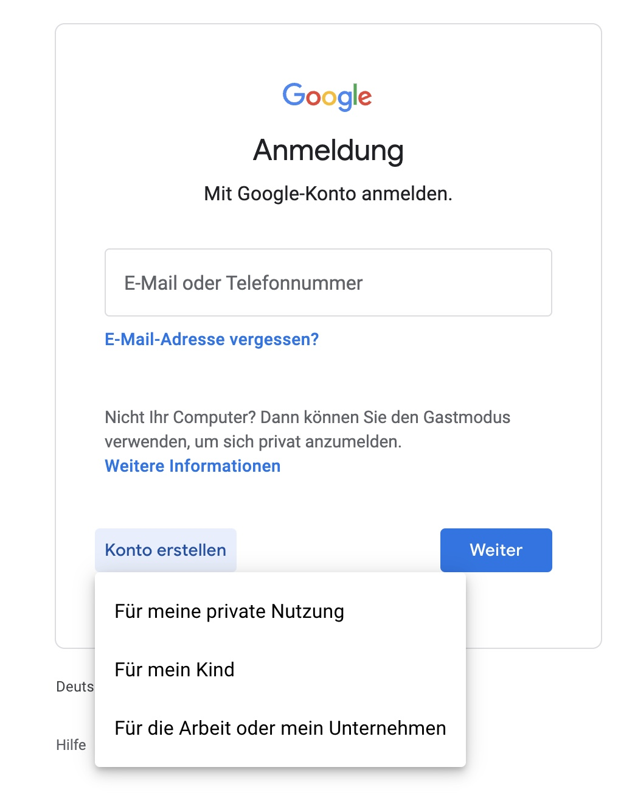

Erstelle ein Google-Konto unter [https://accounts.google.com/](https://accounts.google.com/).

Wenn du als Unternehmen, Gemeinde oder Verein aktiv bist, wähle die Option **„Für die Arbeit oder mein Unternehmen“**.  
Als Privatperson wählst du **„Für meine private Nutzung“**.

Für die Erstellung des Kontos benötigst du eine **Handynummer**.

Folge einfach den Anweisungen. Es gibt auch zahlreiche **Videoanleitungen** auf YouTube, die dir bei der Einrichtung am **Smartphone** oder im **Browser** helfen.

