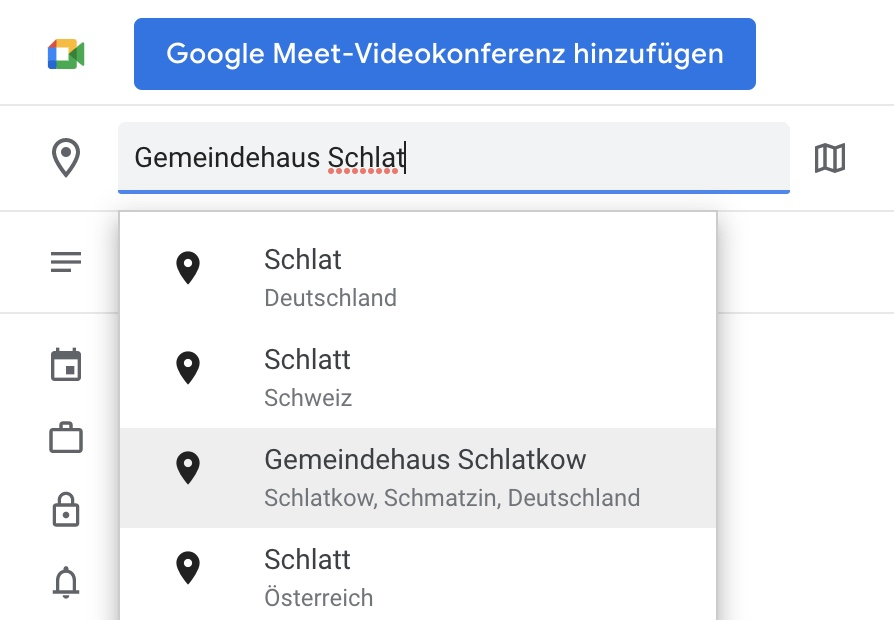

Eine **Ortsangabe** zu deinen Terminen ist **unerlässlich**. Wie sollen wir oder die Nutzer sonst wissen, wo dein Termin stattfindet? Wichtig ist, dass die Ortsangabe **korrekt** und eindeutig ist.

Am besten verwendest du den Ort genauso, wie er dir von **Google** bei der Eingabe vorgeschlagen wird.

Du kannst die Ortsangabe testen, indem du einfach darauf klickst. Der angegebene Ort wird dann im **Google Kalender** direkt auf **Google Maps** angezeigt.

